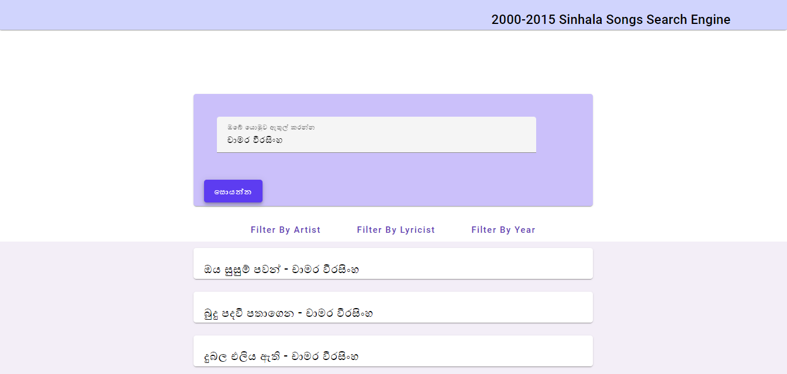

# Mataphor Search For Sinhala Songs

A project done for module CS4642 - Data Mining &amp; Information Retrieval

## Introduction

A metaphor is a figure of speech which describes an object or action in a way that is not literally 
true, but helps explain an idea or make a comparison. It generally compares two things that are 
generally not related or similar, but share a specific quality or characteristic that is emphasized 
through the comparison. 



This repository contains the source code for a Sinhala Song Metaphor Search Engine developed using [ElasticSearch](https://www.elastic.co/) as the search engine and [NodeJS](https://nodejs.org/en/) and [React](https://reactjs.org/) as the web frameworks.

The Sinhala Songs corpus includes roughly 140 songs that have at least one Metaphor. The search engine offers following features for the users.

1. Search songs detaila based on given search phrases, user can use both Sinhala and English.
2. Filter search results by Artist, Lyrics, and Year.

## Project Structure
```
|___index.json - data file with sinhala songs
|___mapping.json - mapping file for the data_file.json file
|___server - back end system
|___client - the front end UI of the system
```

## Data fields
* Title_En
* Title_Si
* Artist_En
* Artist_Si
* Lyricist_En
* Lyricist_Si
* Lyrics
* Metaphors
    * Metaphor
    * Meaning
    * Source
    * Target

## Prerequisites

* ElasticSearch v8.5.3
* Kibana v8.5.3 (Optional)
* NodeJS v14.15.4

## Setup

1. After downloading ElasticSearch install [ICU Analysis](https://www.elastic.co/guide/en/elasticsearch/plugins/current/analysis-icu.html) plugin. we use this because this provide features including better analysis of Asian languages, Unicode normalization, Unicode-aware case folding, collation support, and transliteration.
2. Run an elasticsearch instance on port 9200.
3. Clone the repositary and go to the directory to create an index named `sinhalasongsdata` in the Elasticsearch using below curl requests.
    ```
    curl -X PUT "localhost:9200/sinhalasongsdata?pretty" -H "Content-Type: application/json" -d @mapping.json --user "elastic:your elasticsearch password"

    curl -X POST "localhost:9200/sinhalasongsdata/_bulk?pretty" -H "Content-Type: application/json" --data-binary @index.json --user "elastic:your elasticsearch password"
    ```
4. Run `npm install` followed by `nodemon index.js` inside Backend directory.
5. Run `npm install` followed by `npm start` inside frontend directory.
6. Open the browser and goto `localhost:3000`
